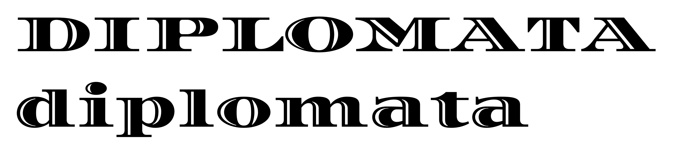
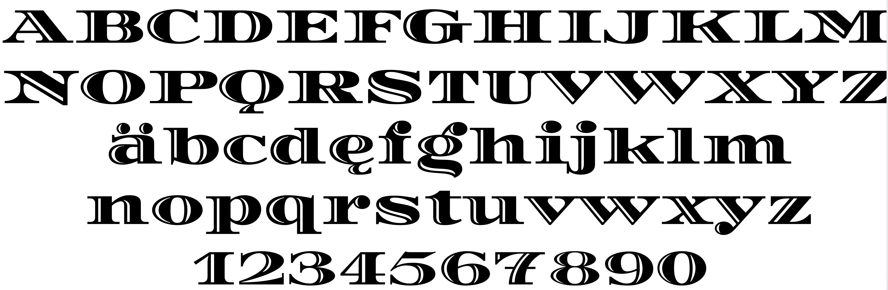
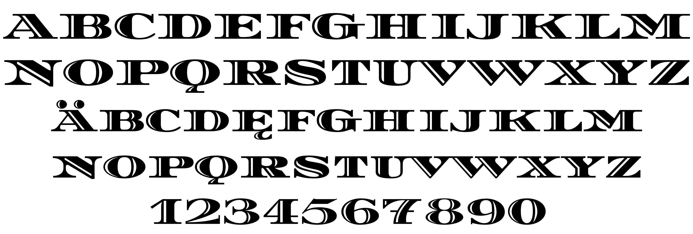

### Diplomata and Diplomata SC

Diplomata started several years ago when a friend in the printing industry who had an old metal typeface wanted it to be digitalized for offset printing. He brought everything the original type offered as a start, a set of upper case characters, numbers, and some punctuation marks.

But what he brought in printed form was not enough to meet his needs, and letterforms that did not exist had to be created. It is a fine job to reinterpret a design, to make decisions on what already exists and also have in mind the changes needed for the new technological context where Diplomata will be used.

Its style, similar to Bodoni, has a remarkable degree of horizontal expansion; a weight which indicates verticality; areas between serif and stem softened by a curve connecting them, and the light in the main stroke of each glyph is a detail that lightens up and gives prominence to Diplomata. It is a distinct typeface, ideal for composing headlines and small prestigious pieces of text.

To improve and expand the use of Diplomata, it was necessary to create small caps and a lower case, which ended up constituting this family that has two variables today.

### Designer

* Eduardo Rodríguez Tunni

### License

Licensed under the [*SIL Open Font License, 1.1*](https://scripts.sil.org/OFL); you may not use this file except in compliance with the License.

To contribute to the project contact Eduardo Rodríguez Tunni > edu@tipo.net.ar
